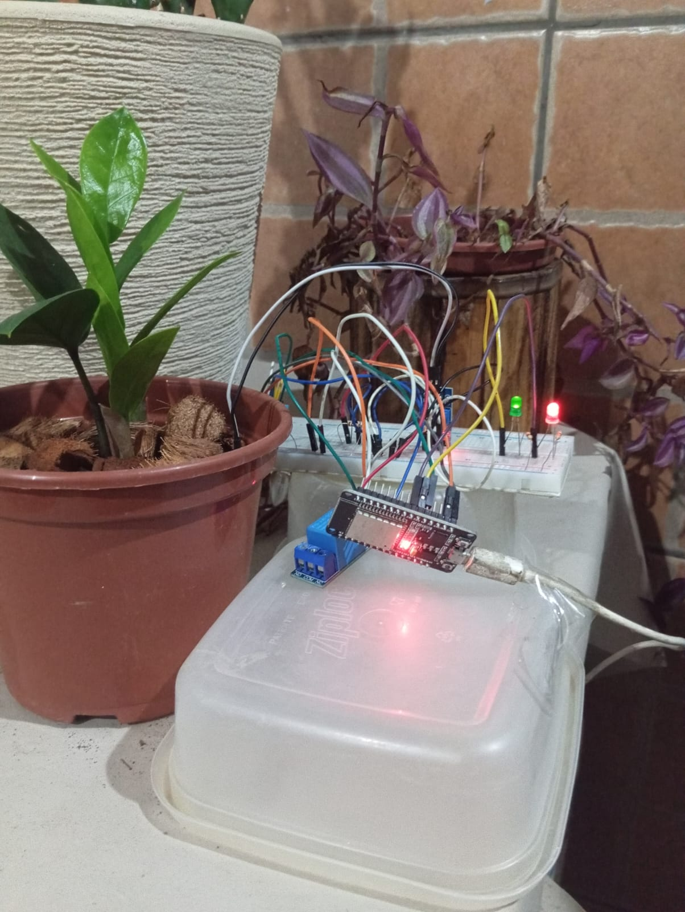
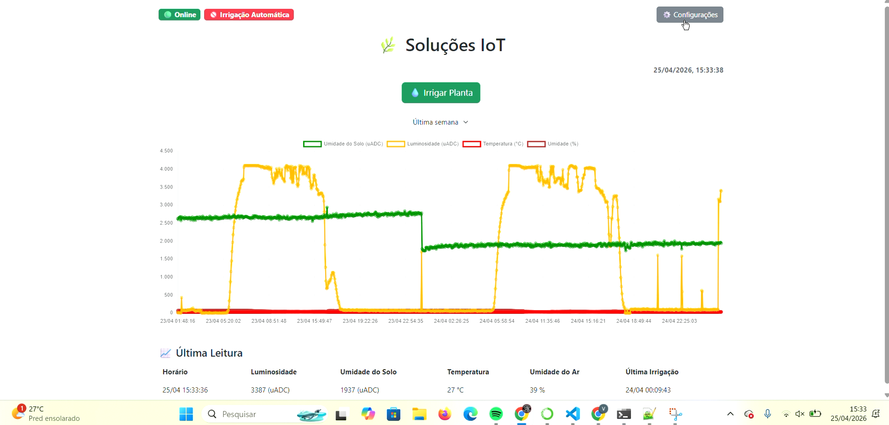

# 🌿 Smart Irrigation System with ESP32 and IoT

This project was developed for real-time plant monitoring and automatic irrigation using ESP32, MQTT, and a web-based interface.

## 🚀 Features

- 📡 Real-time monitoring:
  - Soil moisture
  - Temperature
  - Air humidity
  - Light intensity

- 💧 Irrigation:
  - Manual (via web button)
  - Automatic (based on soil moisture threshold)

- ⚙️ Remote configuration:
  - Minimum soil moisture threshold
  - Minimum interval between irrigations
  - Pump activation time
  - Enable/disable automatic mode
  - Configuration is stored in ESP32 non-volatile memory, ensuring persistence after reboot

- 💡 System status indicators:
  - LED indicator for Wi-Fi connection status  
  - LED indicator for MQTT connection status  
  - Provides quick visual feedback for system debugging and reliability

- 📊 Web dashboard:
  - Historical graphs (24h, 48h, 1 week)
  - Device online/offline status
  - Last irrigation timestamp
  - Real data collected over several days
  - Clear visualization of sensor behavior, including soil moisture variation after irrigation events

## 🧠 Architecture

ESP32 → MQTT → Backend (Flask) → Web Dashboard  
ESP32 ← MQTT ← Backend (Flask) ← Web Dashboard  

- ESP32 publishes sensor data via MQTT  
- Backend stores data in CSV files using Pandas  
- Web interface consumes data through a Flask API  
- Commands are sent to the ESP32 via MQTT  

## 🛠️ Technologies Used

- Python (Flask, Pandas)  
- MQTT (paho-mqtt)  
- ESP32 (Arduino framework)  
- HTML + Bootstrap + Chart.js  
- KiCad  

## 🔌 Hardware Implementation

- Prototype built using a breadboard for data acquisition and testing  
- Sensors and ESP32 connected for real-world measurements  
- System validated with real environmental data over multiple days  

<p align="center">
  
</p>

## 🧩 PCB Design

- Custom PCB designed using KiCad  
- Developed aiming toward a future product-ready solution  

## 📷 Interface

<p align="center">
  
</p>

## ▶️ How to Run

1. Configure your MQTT broker  
2. Adjust file paths in the code  
3. Run the data collection scripts:
   - `server_get_msg.py`
   - `server_get_msg_irrig.py`
4. Start the Flask application:
   ```bash
   python main_flask.py
